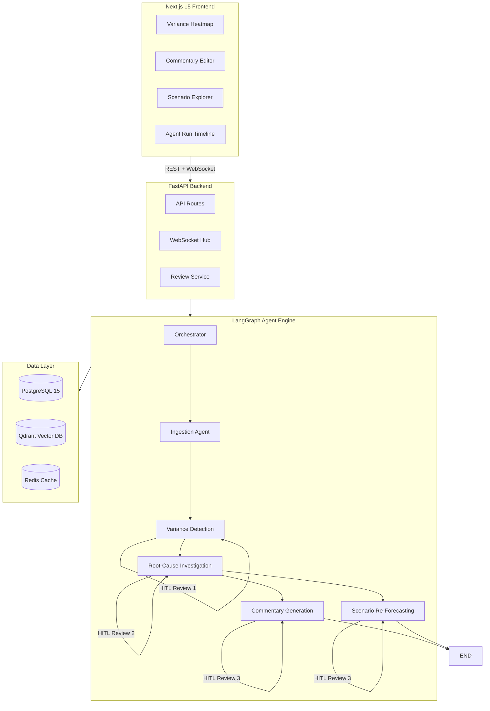
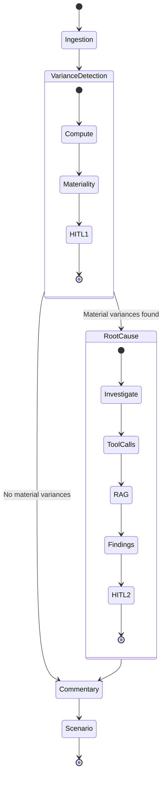

# FinSight — Agentic FP&A Operations Platform

> The AI FP&A analyst that runs your month-end close — detects what changed, figures out why, writes the board commentary, and re-forecasts — all before your morning standup.

## Architecture



## Agent Pipeline



## Tech Stack

| Layer | Technology |
|-------|-----------|
| Agent Orchestration | LangGraph (StateGraph + Supervisor) |
| Persistence | AsyncPostgresSaver (checkpoint-postgres) |
| Backend API | FastAPI (Python 3.12) |
| Frontend | Next.js 15 (App Router, TypeScript) |
| Database | PostgreSQL 15 |
| Vector Store | Qdrant |
| Cache | Redis |
| Observability | Langfuse |
| Containerization | Docker Compose |

## Quick Start

### Prerequisites

- Python 3.12+
- Node.js 22+
- Docker & Docker Compose
- uv (Python package manager)

### 1. Start Infrastructure

```bash
docker compose up -d
```

Services:
- PostgreSQL: `localhost:5432`
- Redis: `localhost:6380`
- Qdrant: `localhost:6333`

### 2. Setup Backend

```bash
python -m venv .venv
source .venv/bin/activate
uv pip install -e ".[dev]"
alembic upgrade head
```

### 3. Setup Frontend

```bash
cd frontend
pnpm install
pnpm dev
```

### 4. Run Tests

```bash
uv run pytest tests/ -v
```

## Project Structure

```
finsight/
├── backend/
│   ├── agents/           # LangGraph agent nodes
│   │   ├── orchestrator.py
│   │   ├── ingestion_agent.py
│   │   ├── variance_agent.py
│   │   ├── root_cause_agent.py
│   │   ├── commentary_agent.py
│   │   └── scenario_agent.py
│   ├── tools/            # Agent tool functions
│   │   ├── gl_tools.py
│   │   ├── headcount_tools.py
│   │   ├── vendor_tools.py
│   │   ├── pipeline_tools.py
│   │   └── rag_tools.py
│   ├── models/           # Pydantic + SQLAlchemy models
│   │   ├── state.py
│   │   ├── financial.py
│   │   └── database.py
│   ├── api/              # FastAPI routes
│   │   ├── routes.py
│   │   └── websocket.py
│   ├── data/             # Synthetic dataset
│   │   └── seed.py
│   ├── config.py
│   └── main.py
├── frontend/
│   ├── src/
│   │   ├── app/          # Next.js App Router pages
│   │   ├── components/   # React components
│   │   └── lib/          # API client
│   └── package.json
├── tests/                # pytest test suite
├── alembic/              # Database migrations
├── docker-compose.yml
└── pyproject.toml
```

## Demo Scenarios

### Scenario A: Revenue Miss (Deal Slippage)
- EMEA revenue down 12% vs budget
- Root cause: $2M enterprise deal slipped from June to July
- Agent traces through GL → pipeline → historical patterns

### Scenario B: Cost Overrun (Vendor Pricing)
- Cloud infrastructure costs up 35%
- Root cause: AWS committed-use discount expired
- Agent traces through vendor invoices → pricing change

### Scenario C: Clean Month
- All variances below materiality threshold
- Orchestrator skips root-cause investigation
- Commentary generated with "no material concerns" template

## API Endpoints

| Method | Path | Description |
|--------|------|-------------|
| GET | `/api/v1/health` | Health check |
| POST | `/api/v1/pipeline/run` | Trigger month-end pipeline |
| GET | `/api/v1/pipeline/{id}/status` | Get pipeline status |
| WS | `/ws/agent-progress` | Real-time agent progress |

## License

MIT
