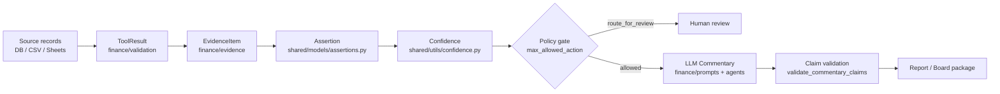

# AI Architecture Guide

**Document:** `docs/07-ai-runtime/ai-architecture-guide.md`
**Scope:** End-to-end AI architecture — deterministic compute, feature store, ML lifecycle, evidence-to-reasoning pipeline, evaluation, governance
**Authoritative plan:** `docs/14-platform/implementation-plan.md` (v3, locked stack)
**Related disciplines:** `docs/09-platform/agentops.md`, `docs/09-platform/llmops.md`, `docs/09-platform/mlops.md`, `docs/09-platform/dataops.md`, `docs/09-platform/devsecops.md`
**Status:** Active — design guide. Design decisions D1–D8 are **RESOLVED** and recorded in ADRs ADR-011–ADR-015 (`docs/adr/`). Where an older document conflicts with a resolved decision, plan v3 + the ADR supersede the older document on that point only (§9). Future ambiguities are flagged as open items in §9 rather than invented.

---

## 1. Purpose & Scope

FinSight's AI is not a single model or agent — it is a **layered pipeline** in which each tier has a different contract with trust. Numbers are computed by deterministic engines; models fill pattern-recognition gaps that rules cannot reach; and the LLM only explains what has already been verified.

This guide describes the architecture that makes that division enforceable:

1. **The deterministic-first principle** and its boundary rules (§2)
2. **The four-stage analytics stack** (descriptive → diagnostic → predictive → prescriptive) mapped onto the layered repo (§3)
3. **The feature store** that feeds predictive and prescriptive layers (§4)
4. **The ML lifecycle** — 3 CPU-first models, `RiskProvider` protocol, model registry, drift, degraded mode (§5)
5. **The evidence → reasoning pipeline** — evidence, assertions, confidence, LLM commentary, report (§6)
6. **Evaluation** — golden datasets, regression harness, metrics, CI gates (§7)
7. **Governance & safety** — tenant isolation, RAG boundaries, auditability, degraded modes, capability rollout (§8)
8. **Decision register** — D1–D8 resolved, recorded in ADR-011–ADR-015 (§9)

Cross-cutting constraints that apply to every section:

- **Monetary values are `Decimal` only.** `float` is rejected at every Pydantic boundary via `MoneyDecimal` (`apps/api/schemas.py`, `finance/domain/_types.py`). ML models convert `Decimal → float` only at the model boundary.
- **One-direction dependency flow:** `shared ← finance ← agents ← apps`. `finance/` never imports an LLM client; `agents/` never imports `apps/`.
- **Job-oriented compute:** `POST /jobs → 202 + job_id → GET /jobs/:id`, executed by the Execution Runtime at `apps/compute` behind a Dramatiq/Redis dispatcher. No WebSockets in MVP.

---

## 2. The Deterministic-First Principle

FinSight is **deterministic-first**. Every financial number — variance, KPI, materiality, bridge decomposition, forecast output — is produced by pure Python engines using `Decimal` arithmetic and is 100% reproducible (NFR-02: identical inputs produce identical outputs). This is recorded in `docs/03-system-design/ADR/0005-deterministic-vs-llm.md` and reinforced by `docs/adr/ADR-007-no-llm-calculations.md`.

ML is used **only where rules are weak** — and exactly **three models** are committed for MVP (§5). LLM is used **only to explain, summarise, or recommend from verified assertions** — it never computes.

### 2.1 The boundary contract

```
┌────────────────────────────────────────────────────────────────────┐
│                       LLM DOMAIN (language only)                   │
│                                                                    │
│  Planner:      query → ActionPlan (intent decomposition)          │
│  Commentary:   assertions → narrative (text rendering)            │
│  Root cause:   assertions → hypotheses (candidate explanations)   │
│  Scenario:     context → parameter proposals (no projection)      │
│                                                                    │
│  RESTRICTED TO: language, intent, structure, narrative             │
│  NEVER:        arithmetic, computation, fact generation            │
└───────────────────────────────┬────────────────────────────────────┘
                                │
                 ActionPlan + Assertions (typed, evidence-backed)
                                │
                                ▼
┌────────────────────────────────────────────────────────────────────┐
│                  DETERMINISTIC DOMAIN (compute)                    │
│                                                                    │
│  formula_engine/      formula + KPI evaluation                     │
│  variance_engine/     variance + materiality (MaterialityEngine)   │
│  kpi_engine/          KPI computation via FormulaRegistry          │
│  scenario_engine/     deterministic projection                     │
│  driver_engine/       bridge decomposition (price/volume/mix)      │
│  validation/          fiscal calendar, data quality (6 checks)     │
│  evidence/            evidence collection and scoring              │
│  shared/utils/confidence.py   deterministic confidence scoring     │
│                                                                    │
│  GUARANTEED: 100% reproducible, Decimal precision                  │
└────────────────────────────────────────────────────────────────────┘
```

### 2.2 Boundary rules (explicit)

| # | Rule | Enforcement |
|---|------|-------------|
| B1 | **Descriptive and diagnostic analytics never use an LLM.** Variance computation, materiality assessment, KPI calculation, and bridge decomposition run on Polars + DuckDB in `finance/` with zero LLM calls. | CI arithmetic gate scans prompt templates; `finance/` has no `llm_client` import (mypy + code review). |
| B2 | **The LLM never computes.** No addition, subtraction, percentage, ratio, aggregation, average, trend, growth rate, or forecast extrapolation in any prompt. | CI gate rejects arithmetic keywords (`calculate`, `sum`, `percentage`, `ratio`, `average`, ...) in `finance/prompts/templates/`. |
| B3 | **The LLM never sees raw data or the database.** It receives only validated `Assertion` objects and `EvidenceItem` records — never raw rows, never sheet ranges, never the DB. | Pipeline ordering (ADR-012): planner → executor → verifier → reflection; only the planner (LLM) and downstream commentary (LLM) touch the boundary, and both consume typed context. |
| B4 | **Every `$` figure in LLM output references evidence.** The LLM arranges and narrates pre-computed figures; it never introduces a number. | `validate_commentary_claims()` post-render cross-check; `ResponseValidator.validate_evidence()` evidence sufficiency gate. |
| B5 | **Exactly 2 LLM calls per pipeline run.** Planner (query → ActionPlan) + Commentary (assertions → narrative). Executor, verifier, and reflection make zero LLM calls. | Telemetry captures call count; unexpected values trigger alerts (`docs/09-platform/llmops.md`). |
| B6 | **ML is optional and bounded.** Predictive models run only where deterministic rules are weak, are CPU-only, and are gated per tenant by feature flag (`features.ml` in `tenant.yaml`). No ML output overrides a deterministic number. | Feature registry (`finplatform/config/features.py`); hybrid pipeline puts deterministic rules first and business rules last (`docs/09-platform/mlops.md`). |
| B7 | **Monetary values cross the ML boundary as `float` only at the model edge**, converted from `Decimal`-typed source columns; no float money ever re-enters the domain. | Feature pipelines validate `MoneyDecimal` before conversion; `MoneyDecimal` rejects float at every Pydantic boundary. |

### 2.3 What happens if a boundary is violated

The evaluation suite contains dedicated **governance datasets** (`finance/evaluation/datasets/governance/`) that fail the build on violations:

- `forbidden_claim.json` — LLM output must qualify assertions, never make definitive unsupported claims.
- `policy_violation.json` — LLM output must not cross from analysis into enforcement recommendations.
- The `PolicyCompliance` metric (break ≥ 0.90) and `UnsupportedClaimRate` (break ≥ 0.80) gate merges (`docs/09-platform/llmops.md` §Evaluation).

---

## 3. Analytics Architecture — Four-Stage Analytics Stack

The analytics stack maps the four classical analytics stages onto the layered repo. Each stage lives at a specific layer, and each is governed by the deterministic-first principle.

```
                    ANALYTICS STACK          REPO LAYER          PRIMARY TOOLS
   ┌──────────────────────────────────────────────────────────────────────────┐
   │  DESCRIPTIVE  "what happened?"         finance/            Polars, DuckDB │
   │  DIAGNOSTIC   "why did it happen?"     finance/ + agents/  engines + LLM  │
   │  PREDICTIVE   "what will happen?"      finance/ml/         LightGBM, IF   │
   │  PRESCRIPTIVE "what should we do?"     agents/ + finance/  LLM + engines  │
   └──────────────────────────────────────────────────────────────────────────┘
                              dependency flow: shared ← finance ← agents ← apps
```

### 3.1 Stage mapping

| Stage | Question | Owner | Implementation | LLM/ML? |
|-------|----------|-------|----------------|---------|
| **Descriptive** | What happened? | `finance/` | Actuals, budgets, variances, KPIs via `FormulaRegistry` + `MaterialityEngine`; Polars transforms + DuckDB analytics | **None** — fully deterministic |
| **Diagnostic** | Why did it happen? | `finance/` (facts) → `agents/` (hypotheses) | Deterministic variance + materiality → typed assertions → root-cause agent proposes hypotheses from assertions only | LLM for **hypothesis wording only**, never numbers |
| **Predictive** | What will happen? | `finance/ml/` | 3 CPU models via `RiskProvider` protocol (M1 anomaly, M2 forecast, M3 duplicate) — see §5 | **ML** — bounded, optional, feature-flagged |
| **Prescriptive** | What should we do? | `agents/` + `finance/` | Scenario agent proposes parameters → `scenario_engine` projects deterministically; recommendation engine ranks actions from verified assertions | LLM proposes **parameters**; engines compute projections |

### 3.2 Deterministic engines in `finance/` (descriptive + diagnostic core)

| Engine | Module | Produces |
|--------|--------|----------|
| Formula Registry | `finance/formula_engine/formula_registry.py` | Versioned formula evaluation, KPI values (source of truth for all math) |
| Variance + Materiality | `finance/variance_engine/materiality.py` | Variances, tiered materiality assessments (`SensitivityTier`: CRITICAL/HIGH/MEDIUM/LOW) |
| Scenario projection | `finance/scenario_engine/` | Deterministic what-if projections from proposed parameters |
| Bridge decomposition | `finance/driver_engine/` | Price/volume/mix decomposition |
| Fiscal calendar & lifecycle | `finance/validation/` | Period generation, overlap/gap detection, progression |
| Data quality | `finance/validation/data_quality.py` | 6 deterministic quality checks → `DataQualityReport` + degraded modes |
| Evidence | `finance/evidence/engine.py` | `EvidenceEngine.collect()` / `coverage_score()` — evidence items that anchor every assertion |
| Confidence | `shared/utils/confidence.py` | Deterministic confidence per assertion class (fact ≤ ~0.91, causal ≤ 0.85, hypothesis ≤ 0.5, action ≤ 0.9) |

### 3.3 Monetary integrity

- **All monetary arithmetic is `Decimal`** — `MoneyDecimal` rejects `float` at the Pydantic boundary (`apps/api/schemas.py:22`).
- **Database columns are `Numeric(15, 2)`** — never `Float` (`shared/models/database.py`).
- **JSON serialization preserves precision** — `DecimalEncoder` in `shared/utils/encoders.py` serializes `Decimal` as strings.
- **ML feature pipelines convert `Decimal → float` only at the model boundary** and never propagate the result back into the domain as money.

---

## 4. Feature Store

The feature store feeds the three MVP models (§5) and the scenario/recommendation engines with consistent, lineage-tracked features. It lives in `finance/feature_store/` (new). The storage backend is **RESOLVED** (D4, ADR-013): offline Parquet → DuckDB training snapshots; serving Postgres materialized views → inference. Feast is explicitly **not** built. Feature **definitions** are registered in the Metadata Registry (`business/metadata/`), which gives every feature `id, version, owner, status, dependencies, references` (plan v3, Phase 3).

### 4.1 Package layout (target)

```
finance/feature_store/
├── __init__.py
├── groups/                  # one module per feature group
│   ├── __init__.py
│   ├── vendor.py            # vendor features (duplicate detection)
│   ├── invoice.py           # invoice features (duplicate detection)
│   ├── cashflow.py          # cash position + flow features (forecast)
│   ├── department.py        # department/cost-center features (anomaly context)
│   ├── forecast.py          # forecast-engine outputs + lag features (forecast)
│   └── anomaly.py           # engineered anomaly features (amount Z-score, intervals)
├── registry.py              # FeatureRegistry: name → FeatureSpec (id, version, owner, deps)
├── builders.py              # deterministic Polars transforms: source → FeatureFrame
├── serving.py               # point-in-time feature retrieval for inference
├── training.py              # training-window extraction (no leakage)
├── lineage.py               # feature → source column → EvidenceItem/ToolResult trace
└── schemas.py               # Pydantic feature schemas; MoneyDecimal where monetary
```

### 4.2 Feature groups

| Group | Module | Primary consumer | Typical features |
|-------|--------|------------------|------------------|
| **vendor** | `groups/vendor.py` | Duplicate Detection | normalized name, tax id, address fingerprint, payment terms, tenure |
| **invoice** | `groups/invoice.py` | Duplicate Detection | vendor id, amount (`Decimal`), date, line-item count, GL code, currency |
| **cashflow** | `groups/cashflow.py` | Cash Flow Forecast | daily cash position, inflows/outflows, lag features (28d/56d/90d), YoY |
| **department** | `groups/department.py` | Anomaly context / diagnostics | headcount, expense totals, budget vs actual per cost center |
| **forecast** | `groups/forecast.py` | Cash Flow Forecast | forecast-engine outputs, seasonality, calendar regressors |
| **anomaly** | `groups/anomaly.py` | Anomaly Detection | amount Z-score, inter-payment interval, hour-of-day entropy, frequency |

### 4.3 Feature naming and versioning

- **Naming:** `snake_case`, grouped by source — `<group>__<entity>__<feature>`, e.g. `invoice__vendor_id`, `cashflow__position_7d_avg`, `anomaly__amount_zscore`. Feature names must match the `feature_names` registered in the model's `ModelMetadata` (`docs/09-platform/mlops.md` §Model Registry Schema).
- **Versioning:** each `FeatureSpec` carries a semantic version. A breaking change (renamed column, changed semantics) increments the major version and must be coordinated with the consuming model version. Feature versions are recorded in `ModelMetadata.feature_names` so a trained model is always bound to an exact feature schema.
- **Monetary features** are typed `MoneyDecimal` in `schemas.py` and are converted to `float` only inside the model provider.

### 4.4 Staleness and lineage

- **Staleness:** each feature group declares `max_age` (**RESOLVED** D4, ADR-013: vendor daily, cashflow hourly, invoice per batch, anomaly per batch). Stale features surface through `DataQualityReport` (`check_freshness`, > 90 days) and the `STALE_SOURCE` degraded mode (`docs/09-platform/dataops.md`). Inference that consumes stale features is flagged in `RiskEvaluation.metadata["data_freshness"]`.
- **Lineage:** every feature carries a deterministic trace back to source columns — `FeatureFrame → ToolResult (query_fingerprint, tenant_id) → source record`. This extends the DataOps lineage chain (Source → ToolResult → EvidenceItem → Assertion) into the ML layer, so a model prediction can be audited back to the rows that produced it.

### 4.5 Serving vs training split

| Concern | Training | Serving (inference) |
|---------|----------|---------------------|
| Window | Full history, training-window config (`training_start`/`training_end` in `ModelMetadata`) | Point-in-time features for the current entity/batch |
| Leakage | **No leakage** — features computed from data available at prediction time only (lag features, no future info) | Same definition, evaluated "as of" inference time |
| Storage | Offline Parquet/DuckDB snapshots (Polars) | Postgres views or in-memory feature frames via `serving.py` |
| Tenant | Training data is tenant-scoped; cross-tenant pooling is a **future** decision, never default | Retrieval always filters by `tenant_id` (RLS + explicit filters) |
| Freshness | Snapshot at training time, recorded in `ModelMetadata.training_end` | Live evaluation per inference batch with freshness checks |

### 4.6 How ML consumes the store

```
finance/ml/providers/
    │
    ▼
registry.get("cash_flow_forecast").evaluate(context)
    │
    ▼
finance/feature_store/serving.py  ──►  FeatureFrame (tenant-scoped, point-in-time)
    │
    ├── features for model → model.predict(feature_vector)
    └── evidence / lineage metadata → RiskEvaluation.evidence + metadata
```

The model provider never touches raw tables; it receives a `FeatureFrame` built by `serving.py`, which applies the same transforms as `training.py` so training and serving do not drift.

---

## 5. ML Lifecycle (CPU-First)

MLOps discipline is documented in `docs/09-platform/mlops.md`. This guide locks the **MVP model set to three models**, all CPU-only (target hardware: Ryzen 5 3600 in Docker; no GPU), all trained from tabular `Decimal`-backed data via Polars.

### 5.1 The three MVP models

| # | Model | Problem type | Algorithm | Why ML at all | Where rules stop |
|---|-------|--------------|-----------|---------------|------------------|
| M1 | **Anomaly Detection** | Unsupervised anomaly | **Isolation Forest** on engineered features (amount Z-score, inter-payment interval, hour-of-day entropy) | Dollar thresholds produce false positives on legit large payments and miss small anomalies | Rule: `amount > X` misses pattern anomalies |
| M2 | **Cash Flow Forecast** | Time-series regression | **LightGBM** with lag features (28d, 56d, 90d, YoY) + calendar regressors | Moving averages fail on cyclical/event-driven patterns | Rule: "flat + seasonality" is wrong on discontinuities |
| M3 | **Duplicate Invoice Detection** | Hybrid rules + similarity + embeddings + Isolation Forest | Rules first (exact vendor+amount), then cosine similarity on embeddings (pgvector) + amount proximity, then Isolation Forest outlier rejection | "Same vendor, same amount" misses split invoices and slightly altered amounts | Rule: exact match catches only exact duplicates |

> **Model numbering (RESOLVED D5, ADR-014):** M1 = Anomaly Detection, M2 = Cash Flow Forecast, M3 = Duplicate Invoice is authoritative and supersedes earlier drafts that ordered M1 = Cash Forecast.
> **Embeddings (RESOLVED D6, ADR-014):** duplicate detection uses **BAAI/bge-small-en-v1.5** (bge-base-en-v1.5 as the larger option) via `sentence-transformers`, pinned in `ModelMetadata.framework_version` — not all-MiniLM-L6-v2.

> **Note on scope:** `docs/09-platform/mlops.md` lists six candidate models (vendor risk XGBoost, payment anomaly IF, late payment LightGBM, cash-flow LightGBM, duplicate invoice, duplicate vendor HDBSCAN). This guide commits **three for MVP** (M1–M3, **RESOLVED** D5, ADR-014). The remaining candidates (vendor risk, late payment, duplicate vendor) are **stretch goals — deferred, feature-flag gated, post-MVP** — and are never default-on.

### 5.2 Inference Registry and `RiskProvider`

Every model (and every future rule-based provider) implements the `RiskProvider` protocol (`finance/ml/protocol.py` — proposed in `docs/09-platform/mlops.md`):

```python
@runtime_checkable
class RiskProvider(Protocol):
    model_id: str            # matches model registry entry
    version: str             # semantic version

    def evaluate(self, context: dict[str, Any]) -> RiskEvaluation: ...
    def metadata(self) -> ModelMetadata: ...
```

`RiskEvaluation` mirrors `Assertion`: it carries `score`, `confidence`, `evidence` (feature contributions / SHAP values), and `metadata` (latency, model version, data freshness). Agents call providers **only** through `InferenceRegistry` — they never import `lightgbm`, `sklearn`, or any ML package. This is the same pattern used for deterministic engines: swap a rule set for a model without touching agent code.

### 5.3 Model registry, versioning, reproducibility

- **Registry:** `finance/ml/registry.py` holds `ModelMetadata` per version — `model_id`, `version` (semver), `algorithm`, `training_start/end`, `training_rows`, `feature_count`, `feature_names`, `target_column`, `metrics`, `artifact_path`, `framework_version`, `deployed_at`, `retired_at`.
- **Reproducibility:** training runs as a CLI (`uv run python -m finance.ml.train_all`), outside the API container, against snapshotted training data. The training window, feature definitions, and `framework_version` (pinned deps) are recorded so a model version can be rebuilt.
- **Deployment:** Docker Phase 1 — artifacts on a mounted volume (`/app/models/`); the `InferenceRegistry` is populated at startup. Phase 2 (Modal serverless) is possible with zero agent changes because the registry abstracts the transport.

### 5.4 Drift and monitoring

| Metric | Signal | Alert threshold |
|--------|--------|-----------------|
| Prediction drift | PSI of score distribution vs training | PSI > 0.1 |
| Feature drift | Per-feature KS / JS divergence | p < 0.01 for any feature |
| Data drift | Row count, null rate, type violations in inference requests | Row count < 80% expected, null rate > 5% |
| Performance regression | Offline metric delta vs baseline (AUC drop, MAPE rise) | > break threshold in `Comparator` |
| Freshness | Hours since last training | > 2× expected retraining interval |

Retraining is scheduled (weekly for the cash-flow forecast, per ingestion batch for anomaly/duplicate) or drift-triggered, and a retrained model **cannot deploy if the regression check fails** (`docs/09-platform/mlops.md` §Evaluation Strategy).

### 5.5 Interpretability (SHAP)

- **Cash Flow Forecast (M2):** SHAP values explain which lag/cashflow/calendar features drive each weekly forecast point. SHAP output is attached to `RiskEvaluation.evidence` and can be surfaced as commentary context — never as a number the LLM invents.
- **Anomaly Detection (M1):** Isolation Forest feature contributions show *why* a payment is anomalous (e.g., amount Z-score dominates). Low-contribution features indicate a spurious flag.
- **Duplicate Detection (M3):** similarity contributions (embedding cosine, amount proximity, vendor match) explain the match decision for human review.

### 5.6 Degraded mode when a model is unavailable

ML is **strictly optional** (`docs/09-platform/mlops.md` §Purpose). When a model cannot run:

1. **Registry miss / load failure** — `InferenceRegistry.get()` raises `KeyError`; the caller catches it and records the failure.
2. **Deterministic rules take over** — the hybrid pipeline's Stage-1 rules (`docs/09-platform/mlops.md` §Hybrid Decision Pipeline) still gate clear-cut cases without ML.
3. **Tenant feature flag** — if `tenant.yaml` sets `features.ml: false`, the model is never invoked; the platform runs entirely on deterministic engines.
4. **Signal propagation** — the outage is surfaced as a degraded mode (e.g., `LOW_COVERAGE` / `STALE_SOURCE` where relevant), policy engine may set `max_allowed_action: route_for_review`, and the report carries a caveat instead of a fabricated prediction.

No prediction is ever silently replaced by an LLM "guess" — a missing model means deterministic-only output plus an explicit caveat, or human review.

---

## 6. Evidence → Reasoning Pipeline

The reasoning pipeline is the spine of the platform: deterministic evidence becomes typed assertions, assertions get deterministic confidence, the LLM renders narrative from assertions only, and the report carries the full lineage. This is the pipeline documented in `docs/07-ai-runtime/Cognitive Runtime.md`, `docs/09-platform/agentops.md`, ADRs `0002-assertion-model`, `0003-reasoning-loop`, `0006-evidence-backed-ai`, and `docs/adr/ADR-012-custom-cognitive-runtime.md` (confirmed pipeline: Planner → Executor → Verifier → Reflection).

### 6.1 Chain overview



### 6.2 Evidence layer (`finance/evidence/`)

- `EvidenceEngine.collect(account_id, period_id)` gathers `EvidenceItem`s; `coverage_score(period_id)` scores evidence sufficiency.
- `EvidenceItem` carries `source_type`, `source_id`, `source_value` (`MoneyDecimal`), `confidence` (`EvidenceConfidence`), `assumptions`, `limitations` — the machine-verifiable chain `Assertion → EvidenceItem → Source Record` (`docs/09-platform/dataops.md` §Lineage Model).
- **Current state:** the engine contract exists (`finance/evidence/engine.py`); source-backed collection is thin today and fills in as connectors land (plan v3, Phase 5). The chain is validated end-to-end by `shared/utils/validators/assertion_validator.py` (evidence count/source rules per assertion type).

### 6.3 Assertion layer (`shared/models/assertions.py`)

Every claim the system can make is a typed `Assertion`:

```python
class Assertion(BaseModel):
    id: str
    type: AssertionType            # numeric | comparative | causal | hypothesis | action
    value: Decimal | None
    evidence_ids: list[str]        # → EvidenceItem ids
    support_level: SupportLevel    # verified | probable | weak | insufficient
    confidence: float              # from shared/utils/confidence.py
    contradictions: list[str]
    missing_evidence: list[str]
    max_allowed_action: str        # route_for_review | block | escalate | ...
    source: str                    # "deterministic" | "llm_analysis" | "human"
```

Validation rules per type (min evidence, min sources, support ceiling) are enforced by `assertion_validator.py`; insufficient evidence downgrades support level — a claim never reaches the user as VERIFIED without support.

### 6.4 Confidence scoring (`shared/utils/confidence.py`)

Confidence is **deterministic**, computed from verifiable metadata only (evidence count, source count, coverage, quality, freshness, contradictions, recomputability):

| Assertion class | Function | Ceiling |
|-----------------|----------|---------|
| NUMERIC | `compute_fact_confidence` | ~0.91 (saturates with evidence) |
| COMPARATIVE | `compute_comparative_confidence` | fact confidence, capped |
| CAUSAL | `compute_causal_confidence` | 0.85 — causal never "verified" |
| HYPOTHESIS | `compute_hypothesis_confidence` | 0.50 — hypothesis never "probable" |
| ACTION | `compute_action_confidence` | 0.90 |

The pipeline finalizes when `overall_confidence >= 0.7` and no gaps remain (`ReflectionNode`, `docs/09-platform/agentops.md`).

### 6.5 LLM commentary — receives ONLY assertions/evidence

- The LLM's commentary input is the **rendered context pack of verified assertions and evidence**, never raw data. Prompt templates are versioned in `finance/prompts/registry.py` and rendered by `finance/prompts/renderer.py`; input/output schemas are Pydantic (`finance/prompts/schemas.py`) with `MoneyDecimal`.
- Every LLM call passes a `response_model` — no free-text output, no `json.loads()` on raw LLM text (ADR-004, `docs/09-platform/llmops.md` §Structured Output Pipeline).
- Post-render, `validate_commentary_claims()` cross-checks every `$` figure against evidence IDs.

### 6.6 Guardrails

| Guardrail | Where | Effect |
|-----------|-------|--------|
| No arithmetic in prompts | CI arithmetic gate | Build fails on arithmetic keywords |
| No LLM in `finance/` | Dependency rules + mypy | Architectural boundary |
| Exactly 2 LLM calls/run | Telemetry | Unexpected counts alert |
| Structured output only | `LLMClient.generate(response_model=...)` | Malformed output retried → `route_for_review` |
| Evidence sufficiency | `ResponseValidator.validate_evidence()` | Unsupported claims flagged |
| Policy routing | `max_allowed_action` | Blocked/escalated assertions stop before report |

---

## 7. Evaluation

Evaluation extends the golden-dataset framework in `finance/evaluation/` (`docs/08-evaluation/`): `GoldenDataset` (`dataset.py`), loader (`loader.py`), `EvaluationRunner` (`runner.py`), metrics (`metrics.py`), and `Comparator`/`RegressionRunner` (`regression.py`).

### 7.1 Golden datasets

Datasets live in `finance/evaluation/datasets/` as JSON, each combining `metadata`, `input`, and `expected` behavior across planning, execution, verification, reflection, and output:

| Category | Purpose |
|----------|---------|
| `financial_logic/` | 7 datasets — varied financial scenarios (fx, budget variance, negative revenue, seasonality, ...) |
| `data_quality/` | 5 datasets — quality gates and degraded conditions |
| `runtime_behaviour/` | 4 datasets — degraded pipeline behaviour (unsupported assertions, retry, replanning) |
| `governance/` | 4 datasets — forbidden claims, policy violations, low confidence, contradictory evidence |
| `predictive_models/` (proposed) | 6 datasets — one per model (forecast, anomaly, duplicate, ...) |

### 7.2 Metrics by component

| Component | Primary metrics | Target/break |
|-----------|-----------------|--------------|
| **Forecast (M2)** | MAPE (13-week horizon), RMSE, MAE, bias | MAPE tolerance default 15% (`ForecastError` score = 1 − min(MAPE/tol, 1)) |
| **Anomaly (M1)** | Precision@K (K=50), Recall@K, false-positive rate | Break thresholds in `thresholds/runtime.yaml` |
| **Duplicate (M3)** | Precision@10, Recall, F1, pairwise accuracy | Break thresholds in `thresholds/business.yaml` |
| **LLM commentary** | `UnsupportedClaimRate` (≥0.80 break), `EvidenceCoverage` (≥0.60 break), `PolicyCompliance` (≥0.90 break), `ReportCoverage` (≥0.80 break) | Governs merge |
| **Pipeline runtime** | `PlanningAccuracy`, `ActionSuccessRate`, `RetryRate`, `AverageLatency`, `ToolFailureRate`, `ReplanningFrequency` | `OverallScore ≥ 0.7` passes |
| **Financial correctness** | `VarianceAccuracy`, `KPIAccuracy` | Exact `Decimal` matches (or configured tolerance) |

### 7.3 Regression harness

`RegressionRunner.run_and_compare()` stores a baseline in `.regression_baseline/baseline.json`. Each run is compared by `Comparator`; a metric delta exceeding its `break_` threshold yields `REGRESSION_DETECTED` and **fails the build**. The same harness evaluates ML models — a retrained model cannot deploy if the offline metrics regress.

### 7.4 LLM structured-output compliance and hallucination checks

- **Structured-output compliance:** every LLM response is validated against its Pydantic `response_model`; validation failures retry (max 3×) with the error appended to the prompt, then degrade to `route_for_review`. CI gate `finance/evaluation/datasets/governance/` exercises forbidden-claim and policy-violation scenarios.
- **Hallucination checks (unsupported claims):** `UnsupportedClaimRate` measures whether narrative assertions are backed by deterministic evidence; `validate_commentary_claims()` rejects `$` figures without evidence IDs. The metric is explicitly *not* "model hallucination" — the deterministic runtime makes unsupported claims a measurable, preventable class.

### 7.5 Where evaluation gates live in CI

```
Commit ──► ruff check . ──► mypy . ──► pytest (685+ tests)
                                      │
                                      ├── golden datasets (EvaluationRunner)
                                      │      └── regression compare (RegressionRunner)
                                      │             └── REGRESSION_DETECTED → fail
                                      ├── LLM arithmetic gate (prompt scan)
                                      ├── governance datasets (boundary violations)
                                      └── predictive_models (offline ML metrics)
Merge
```

Plan v3 Phase 7 formalizes `.github/workflows` (lint, mypy, pytest, golden datasets). Thresholds are config-driven (`finance/evaluation/thresholds/{business,runtime}.yaml`), promoted to the Evaluation Registry in plan v3 Phase 3.

---

## 8. Governance & Safety

### 8.1 Tenant isolation

- **Database layer (primary):** every tenant-scoped row carries `tenant_id`; RLS is enforced at the database using the `app.tenant_id` session variable (`database/migrations/001_extensions.sql`, `006_rls.sql`, `007_audit_triggers.sql`; `docs/12-database/rls.md`). Per ADR-0001 the de-facto variable is `app.tenant_id`; unification to `app.current_tenant_id` is scheduled in plan v3 Phase 1.
- **Application layer:** middleware resolves user → tenant → role and sets the session variable; API routes validate that the authenticated user's tenant matches the requested `tenant_id`.
- **Compute layer:** jobs are tenant-scoped — the dispatcher owns permissions/queue/retry/timeout; the Execution Runtime receives authorized datasets (storage paths `tenant/<id>/artifact/<version>/`), never raw files (plan v3 Phase 4).
- **Agent tools** scope by tenant (`shared/utils/tools/*`).

### 8.2 No data leakage across tenants in RAG/embeddings

- **Vector storage is tenant-scoped.** Embeddings (pgvector per the locked stack, plan v3 §4b) live in tables that carry `tenant_id` with RLS, and retrieval filters by `tenant_id` at query time (plan v3 Phase 4: "vector keys include tenant_id"). **Tenant A memory ≠ Tenant B memory** (plan v3, principle 5).
- **Embedding inference is per-tenant** — no cross-tenant corpus is ever embedded as a shared pool.
- **RAG is off by default.** `tenant.yaml` defaults `features.rag: false`; enabling it is a per-tenant configuration decision (plan v3 Phase 2).
- **Retrieval feeds only the deterministic/evidence layer** — retrieved context is converted into evidence/assertions before any LLM call; the LLM never receives raw retrieved documents directly (B3).

### 8.3 Prompt injection guardrails

The platform's boundary design is the primary injection defense — an attacker cannot inject instructions into "the data" because the LLM never sees raw data:

| Control | Mechanism |
|---------|-----------|
| **No raw data in prompts** | LLM receives only typed assertions/evidence rendered from verified context (B3) |
| **Structured output only** | Pydantic `response_model` on every call; free text rejected |
| **Content boundaries** | Governance datasets (`policy_violation.json`, `forbidden_claim.json`) verify the LLM does not act on embedded instructions |
| **Policy routing** | `max_allowed_action` blocks/escalates suspicious outputs to human review |
| **Tenant-scoped retrieval** | RAG results are scoped by `tenant_id`; cross-tenant content cannot reach a prompt |

> **RESOLVED (D7, ADR-015):** RAG is disabled by default (`features.rag: false`). A tenant may enable RAG only after the evaluation gates pass — prompt-injection evaluation dataset, retrieval benchmarks, grounding tests, and golden datasets. Existing structured data (Sheets, finance ontology, formula registry, business rules) does **not** require RAG.

### 8.4 Auditability — the 10 audit questions

Every action must answer the plan v3 ten questions: **Who? Tenant? Role? Policy? Tool? Prompt? Evidence? Decision? Timestamp? Version?**

| Question | Where it's captured |
|----------|---------------------|
| Who? | `AuditLog.user_id` |
| Tenant? | `AuditLog.tenant_id` + RLS `app.tenant_id` |
| Role? | RBAC role resolution (Phase 1) + audit enrichment (Phase 6) |
| Policy? | `PolicyDecisionLog` (`policy_decision_logs`), `max_allowed_action` on assertions |
| Tool? | `Action.tool` in execution traces; `audit_logs.event_type` |
| Prompt? | Prompt version from `PromptRegistry` (Phase 6 audit enrichment) |
| Evidence? | `Assertion.evidence_ids` → `EvidenceItem` → source; audit enrichment (Phase 6) |
| Decision? | `ReviewDecision` / `review_decisions`, `loop_decision` in `.reasoning_traces/` |
| Timestamp? | `AuditLog.created_at`, `Job` timestamps |
| Version? | Metadata Registry versions (formula, prompt, model, feature, dataset) |

`docs/12-database/audit.md` and plan v3 Phase 6 (audit enrichment: role, policy decision, tool, prompt version, evidence IDs) define the target.

> **Audit ordering is non-negotiable (RESOLVED D8, ADR-015):** Import → Validation → Audit → AI → Recommendation. NEVER AI → Audit. The audit layer must land before any ML/LLM capability is promoted to `production`; a capability whose audit chain cannot answer all 10 questions is not `production`.

### 8.5 Degraded modes

Degraded modes are first-class enums (`shared/models/degraded_mode.py`) and propagate from data quality → policy → routing:

| Mode | Trigger | Effect |
|------|---------|--------|
| `LOW_COVERAGE` / `STALE_SOURCE` | Data quality checks (DataOps) | Pipeline proceeds with caveat; policy may lock autonomy to `MANAGER_APPROVAL` |
| `INSUFFICIENT_CAUSAL_EVIDENCE` | Causal assertions lack evidence classes | Root-cause hypotheses qualified, never verified |
| `FACT_VERIFIED_CAUSE_UNVERIFIED` | Fact holds, cause unknown | Report separates fact from speculation |
| Model unavailable | `InferenceRegistry.get()` fails / `features.ml: false` | Deterministic-only output + caveat (§5.6) |
| LLM provider down | All providers in cooldown | Pipeline halts with clear error; no silent fallback (`docs/09-platform/llmops.md`) |
| Malformed LLM output | Pydantic validation fails after retries | `route_for_review` — never enters typed pipeline |

### 8.6 Capability maturity → rollout map

`business/capabilities/` defines 38 capabilities with lifecycle states (`CapabilityStatus`: `discovery → implemented → production → deprecated`) and maturity ratings (`planned/partial/full/production`). Rollout of AI features follows this lifecycle, gated by per-tenant feature flags (`tenant.yaml`):

| Capability status | AI rollout stage | Tenant visibility |
|-------------------|------------------|-------------------|
| `discovery` (planned) | Design/experiment; engines + models may exist but are not exposed | Feature flag off |
| `implemented` (partial/full) | Preview — feature-flagged per tenant (`features.forecasting`, `features.ml`, `features.rag`) | Opt-in preview |
| `production` | Default-on, GA | All tenants (unless flagged off) |
| `deprecated` | Disabled; replaced by successor capability | Off |

Representative AI capability mapping:

| Capability | AI component | Maturity today |
|------------|--------------|----------------|
| `cap.variance` (Variance Analysis) | Deterministic engines + root-cause/commentary agents | production |
| `cap.reporting.board` (Board Reporting) | Commentary agent over assertions | production |
| `cap.forecast.cashflow` (Cash Flow Forecasting) | M2 Cash Flow Forecast (LightGBM) | planned → ships behind `features.ml` |
| `cap.governance.dataquality` (Data Quality) | M1 Anomaly Detection (Isolation Forest) | partial |
| `cap.ap.invoice` (Invoice Processing) | M3 Duplicate Detection (hybrid) | production (rules) + ML behind flag |

`implemented_capabilities()` / `maturity_report()` (`business/capabilities/registry.py`) feed the service catalog and routing — the same registry that decides what is safe to expose.

---

## 9. Decision Register — D1–D8 RESOLVED

The AI architecture decisions D1–D8 are **RESOLVED** by the decision-maker and recorded in ADRs ADR-011–ADR-015 (`docs/adr/`). **Supersession rule:** where an older document conflicts with a resolved decision, plan v3 + the ADR supersede the older document **on that point only**; the older document (e.g., `docs/09-platform/llmops.md`, `agentops.md`, `mlops.md`, `devsecops.md`, or plan v3 §4b) is left in place and remains valid on all other points.

### 9.1 Resolved decisions

| # | Decision | Outcome — RESOLVED | ADR | Supersedes (on this point) |
|---|----------|--------------------|-----|----------------------------|
| D1 | **LLM client / provider abstraction** | ✅ **LiteLLM** is the provider abstraction. Business code never knows provider names. The `LLMProvider` interface is preserved. Runtime chain: **LLM Runtime → LiteLLM → Gemini / Groq / OpenRouter / future Azure / future OpenAI**. | ADR-011 | plan v3 §4b "AI = LiteLLM + LangGraph" (LiteLLM half confirmed); llmops.md custom-router description |
| D2 | **Agent orchestration** | ❌ **REJECT LangGraph.** Keep the **Custom Cognitive Runtime** — intentional: *"inspired by LangGraph concepts, not dependent on the LangGraph runtime."* Pipeline: **Planner → Executor → Verifier → Reflection**. NOT a temporary stopgap. | ADR-012 | plan v3 §4b "LangGraph"; agentops.md 5-node (Planner → Retriever → …) pipeline shape |
| D3 | **Vector store** | ✅ **pgvector** in the single PostgreSQL DB — same transaction boundary, same RLS, same backup, simpler deployment. **Qdrant is out of MVP** (only for billions of vectors / hybrid search). | ADR-013 | devsecops.md Qdrant compose container + `qdrant_url` settings |
| D4 | **Feature store** | ✅ **Formalized two-plane store — no Feast.** Offline = Parquet → DuckDB → training snapshots; Serving = Postgres materialized views → inference. Staleness: vendor daily, cashflow hourly, invoice per batch, anomaly per batch. | ADR-013 | (formalizes plan v3 data layer; no conflicting doc) |
| D5 | **ML model set** | ✅ **Lock exactly 3:** M1 Anomaly Detection (Isolation Forest), M2 Cash Forecast (LightGBM), M3 Duplicate Invoice (hybrid). Vendor risk / late payment / duplicate vendor are **stretch, not MVP**. | ADR-014 | mlops.md six-model inventory (MVP scope); earlier M-numbering drafts |
| D6 | **Embedding model** | ❌ **OVERRIDE: BAAI/bge-small-en-v1.5** (or bge-base-en-v1.5) instead of all-MiniLM-L6-v2 — better retrieval quality, strong open benchmarks, CPU-friendly, excellent with pgvector. | ADR-014 | earlier all-MiniLM proposal (old D6 row of this §9) |
| D7 | **RAG** | ✅ **Disabled by default** (`features.rag: false`). Enable only after prompt-injection evaluation, retrieval benchmarks, grounding tests, and golden datasets pass. Existing structured data (Sheets, finance ontology, formula registry, business rules) does **not** require RAG. | ADR-015 | (confirms plan v3 Phase 2 default; adds the evaluation gate) |
| D8 | **Audit** | ✅ **Non-negotiable ordering:** Import → Validation → Audit → AI → Recommendation. NEVER AI → Audit. Audit must land before any ML/LLM capability reaches `production`. | ADR-015 | plan v3 Phase 6 sequencing (audit is an MVP gate for AI features, not post-MVP) |

### 9.2 Open items

No AI architecture decisions are currently open. The revisit conditions recorded in the ADRs (RAG enablement at scale, LangGraph reconsideration, Qdrant at billions of vectors, stretch ML models) are future decisions — not open questions for this guide.

---

## 10. Reference Map

| Topic | Where to look |
|-------|---------------|
| Deterministic/LLM boundary | `docs/03-system-design/ADR/0005-deterministic-vs-llm.md`, `docs/adr/ADR-007-no-llm-calculations.md`, `docs/adr/ADR-001-hybrid-ai-architecture.md`, `docs/adr/ADR-015-ai-trust-boundary.md` |
| AI decision register (D1–D8) | `docs/adr/ADR-011-litellm-provider-abstraction.md`, `docs/adr/ADR-012-custom-cognitive-runtime.md`, `docs/adr/ADR-013-postgresql-pgvector-unified-data-platform.md`, `docs/adr/ADR-014-minimal-ml-strategy-m1-m3.md`, `docs/adr/ADR-015-ai-trust-boundary.md` |
| Assertion model | `shared/models/assertions.py`, `docs/03-system-design/ADR/0002-assertion-model.md` |
| Reasoning pipeline | `docs/07-ai-runtime/Cognitive Runtime.md`, `Planner.md`, `Executor.md`, `Verification.md`, `Reflection.md`, `docs/03-system-design/ADR/0003-reasoning-loop.md`, `docs/adr/ADR-012-custom-cognitive-runtime.md` |
| Evidence lineage | `finance/evidence/engine.py`, `finance/domain/evidence.py`, `docs/09-platform/dataops.md`, `docs/adr/ADR-006-evidence-backed-ai.md` |
| Confidence | `shared/utils/confidence.py`, `shared/utils/validators/assertion_validator.py` |
| AgentOps / LLMOps / MLOps / DataOps / DevSecOps | `docs/09-platform/agentops.md`, `llmops.md`, `mlops.md`, `dataops.md`, `devsecops.md` |
| Evaluation | `finance/evaluation/` (`dataset.py`, `loader.py`, `metrics.py`, `runner.py`, `regression.py`), `docs/08-evaluation/` |
| Platform plan (locked stack, phases) | `docs/14-platform/implementation-plan.md` |
| Tenant isolation | `docs/12-database/rls.md`, `docs/12-database/audit.md`, `database/migrations/006_rls.sql`, `docs/adr/0001-platform-package-name-and-orphaned-tests.md` |
| Capability maturity | `business/capabilities/` (`models.py`, `registry.py`) |
| Versioned contracts | `contracts/` (`api/`, `events/`, `datasets/`, `prompts/`, `formulas/`, `connectors/`) |
| Compute execution | `apps/compute` (Execution Runtime — see `docs/adr/ADR-013-postgresql-pgvector-unified-data-platform.md`; `docs/09-platform/compute-runtime.md` pre-dates the `python_runtime/ → apps/compute` rename) |

---

*This document is maintained by the FinSight architecture team. File issues and PRs against `docs/07-ai-runtime/ai-architecture-guide.md`.*
